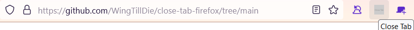

# Close Tab Button Add-on


The Close Tab Button is a simple Firefox add-on that adds a button to toolbar that closes current tab

## Installation
1. Download the latest release from the [Releases](https://github.com/WingTillDie/close-tab-firefox/releases) page.
2. Open Firefox and navigate to `about:debugging`.
3. Click on "This Firefox" in the left sidebar.
4. Click "Load Temporary Add-on..."
5. Select the downloaded XPI file.

Or install from [FireFox Add-ons](https://addons.mozilla.org/en-US/firefox/addon/close-tab-button-touch/)

## Usage

Once the add-on is installed, you will see a "Close Tab" button in your toolbar. Clicking this button will close the current tab.

## Screenshots

This screenshot shows following 2 addons:
* [Close Tab Button](https://github.com/WingTillDie/close-tab-firefox) (This add-on)
* [Undo Close Tab](https://addons.mozilla.org/en-US/firefox/addon/undoclosetabbutton)

## Example use case
Makes Firefox touch-friendly by adding close tab button to toolbar.  
It makes using desktop Firefox on mobile via remote connection easier  
e.g. Using [MultiVNC](https://f-droid.org/en/packages/com.coboltforge.dontmind.multivnc/) or [AVNC](https://f-droid.org/en/packages/com.gaurav.avnc/) on Android to connect to Windows [TightVNC](https://tightvnc.com) Server to use desktop FireFox

Screenshot of showing the add-on in MultiVNC:


Screenshot of showing the add-on in AVNC:


## Development
Create the xpi file from source code:  
```bash
zip -jr close_tab_button_touch.xpi src/
```

## License

This project is licensed under the Apache License 2.0 - see the [LICENSE](LICENSE) file for details.
